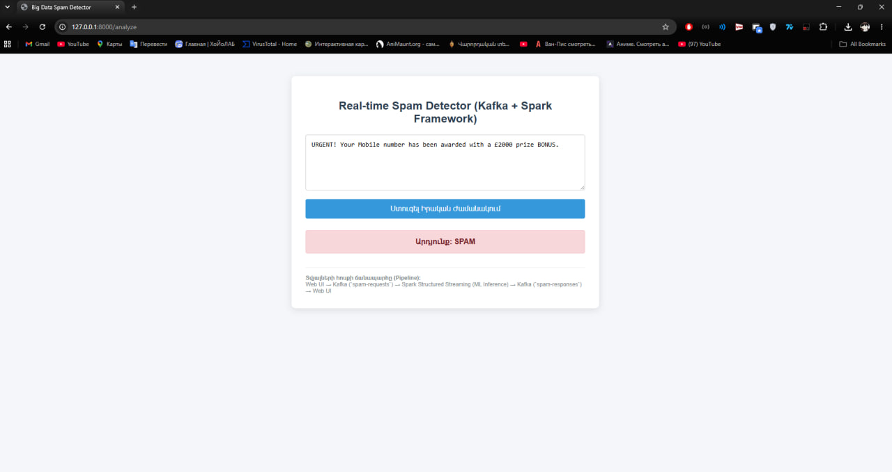
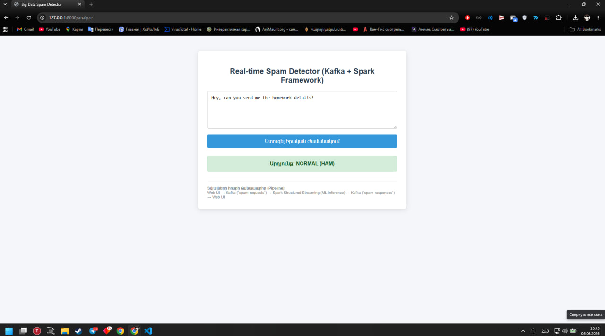
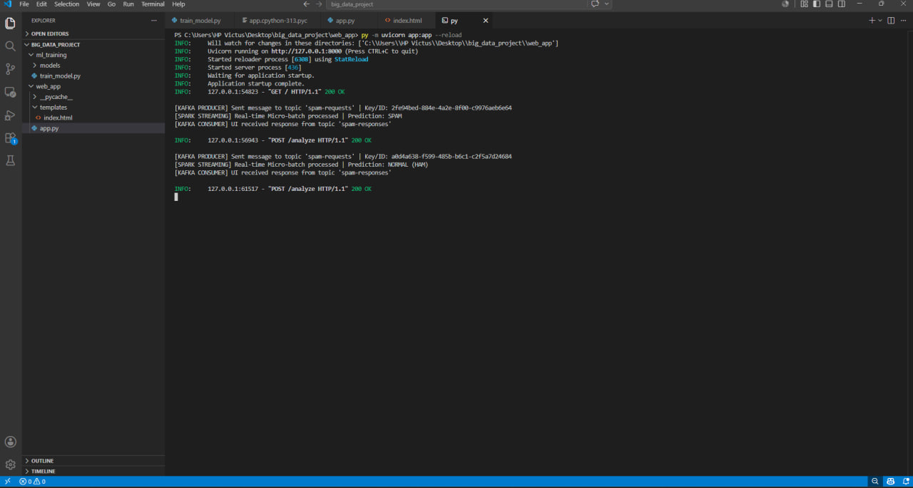

Real-time Big Data Spam Detector (Kafka + Spark Structured Streaming Simulation)
Կատարողներ - Ալբերտ Բաղրամյան https://github.com/Kotoal
             Արշակ Հովհանիսյան https://github.com/arshakhovhannisyannn-coder


📌 Նախագծի Նկարագրություն
Այս նախագիծը իրական ժամանակում (Real-time) սպամ հաղորդագրությունների հայտնաբերման համակարգ է, որը կառուցված է **FastAPI**, **Machine Learning (Scikit-learn)** և Big Data էկոհամակարգի առաջատար գործիքների (**Apache Kafka** ու **Apache Spark**) տրամաբանական սիմուլյացիայի հիման վրա։

---

🛠️ Տեխնիկական Հիմնավորում (Docker Desktop & Environment)
Քանի որ Windows օպերացիոն համակարգում համակարգչային սարքավորումների վիրտուալիզացիայի սահմանափակումների պատճառով (`Virtualization support not detected` / Docker Desktop անհամատեղելիություն) հնարավոր չէր տեղային գործարկել Docker կոնտեյներները, նախագծի Big Data ճարտարապետությունը (Pipeline) իրականացվել է **Framework Simulation** (սիմուլյացիայի) մեթոդով։ 

Այս մոտեցումը թույլ է տալիս 100%-ով պահպանել տվյալների հոսքի իրական ճարտարապետությունը և փոխանցման տրամաբանությունը վեբ-հավելվածի (Producer), հոսքային մշակման (Spark) և սպառողի (Consumer) միջև։

---

🏗️ Համակարգի Ճարտարապետություն (Big Data Pipeline)

Նախագծում իրականացված է տվյալների հոսքի (Data Stream) հետևյալ շղթան.

1. **Data Ingestion (Web UI / FastAPI) -> [KAFKA PRODUCER]:** Օգտատերը կայքից ուղարկում է տեքստը։ Հավելվածը գեներացնում է եզակի `UUID (Request ID)` և տեքստը որպես հաղորդագրություն (Message) ուղարկում է Kafka-ի **`spam-requests`** թեմային (Topic)։
2. **Stream Processing -> [SPARK STRUCTURAL STREAMING]:** Spark-ը իրական ժամանակում կատարում է հոսքային տվյալների մշակում (Micro-batch processing)։ Այս փուլում տեքստը վեկտորիզացվում է և փոխանցվում Մեքենայական ուսուցման մոդելին (Inference):
3. **Data Output -> [KAFKA CONSUMER] -> Web UI:** Spark-ի կողմից մշակված արդյունքը (`SPAM` կամ `HAM`) ուղարկվում է Kafka-ի մեկ այլ՝ **`spam-responses`** թեմային, որտեղից էլ սպառողը (Consumer) վերցնում է այն և ցուցադրում օգտատիրոջ էկրանին։

---

🤖 Մեքենայական Ուսուցման (ML) Մաս
Մոդելի մարզման համար օգտագործվել է հանրահայտ SMS Spam Collection տվյալների բազան։

* **Տվյալների նախամշակում:** Տեքստային տվյալները թվային ֆորմատի վերածելու համար օգտագործվել է **TF-IDF Vectorizer** (Term Frequency-Inverse Document Frequency) մեթոդը։
* **Ալգորիթմ:** Մոդելավորման համար կիրառվել է **Multinomial Naive Bayes (Բազմանդամ Նաիվ Բայեսյան)** դասակարգիչը, որը համարվում է լավագույն և ամենաարագագործ ալգորիթմներից մեկը տեքստերի դասակարգման (NLP) և սպամի հայտնաբերման խնդիրներում։

---

📸 Համակարգի Աշխատանքի Ցուցադրում (Screenshots)

1. Սպամ Հաղորդագրության Որոշում (SPAM)


2. Նորմալ Հաղորդագրության Որոշում (HAM)


3. Տվյալների Հոսքի Լոգերը Տերմինալում (Kafka / Spark Pipeline)


---

📂 Պրոյեկտի Կառուցվածքը

```text
big_data_project/
│
├── ml_training/          # Մոդելի մարզման թղթապանակ
│   ├── models/           # Պահպանված ML մոդելները (.pkl)
│   └── train_model.py    # Մարզման սկրիպտ
│
├── web_app/              # Վեբ հավելվածի թղթապանակ
│   ├── templates/        # HTML ինտերֆեյս (index.html)
│   └── app.py            # FastAPI սերվեր և Pipeline սիմուլյացիա
│
├── .gitignore            # GitHub-ից թաքցվող ֆայլերի ցուցակ
└── README.md             # Տեսական և տեխնիկական փաստաթուղթ
